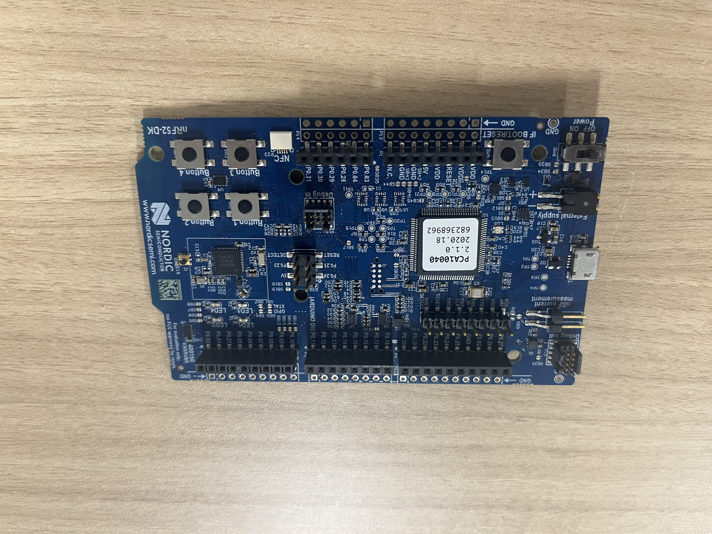
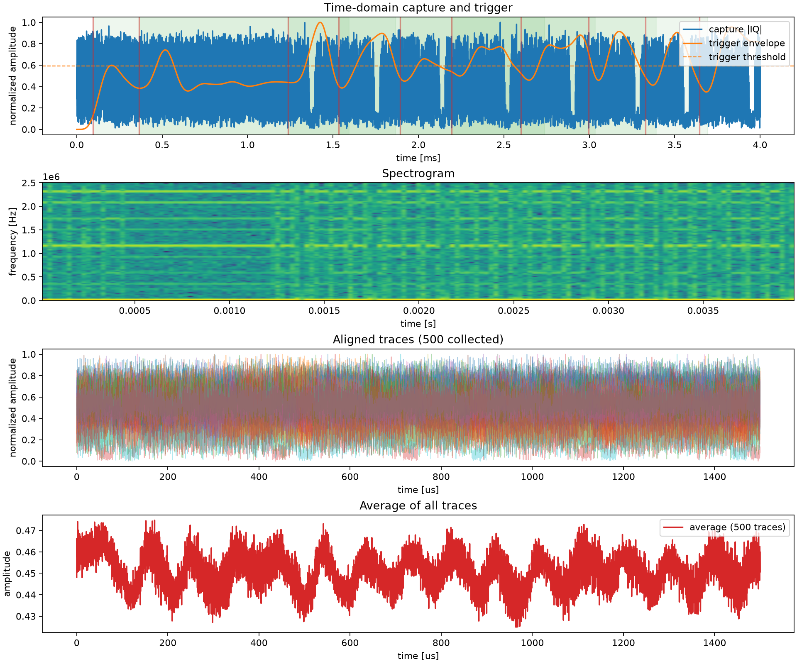

# screaming-channels-ble

**BLE デバイスの電磁サイドチャネルを低コスト SDR で収集するシステム**

nRF52832 DK (PCA10040) に AES-128 を実装し、HackRF One で Screaming Channel 波形を取得・解析するエンドツーエンドの実験基盤です。

---

## 開発背景と目的

ハードウェア上での暗号処理には、意図せず電磁波として鍵情報が漏洩する **Screaming Channels** と呼ばれるサイドチャネル脆弱性が存在します。

従来の研究環境では、波形取得に**数十万円以上のオシロスコープとファンクションジェネレータ**が必要でした。  
本プロジェクトでは、BLE デバイスが元々搭載している無線送信機能を活用し、**HackRF One（約5万円）と macOS PC のみ**で同等の実験が行えるシステムを独自に開発しました。

| 従来手法 | 本システム |
|---|---|
| 高価な計測器（オシロスコープ等）| HackRF One（汎用 SDR）|
| 専用ファンクションジェネレータ | BLE チップ内蔵の RF 送信機を流用 |
| 固定のラボ環境 | macOS + Python で持ち運び可能 |

---

## 技術的なポイント

- **Screaming Channels 原理の応用**: BLE チャネル 4 (2.404 GHz) の CW 送信中に AES-128 を実行し、CPU 動作が RF に混入する現象を利用
- **カスタムファームウェア (C)**: nRF52832 の RADIO レジスタを直接操作して無変調 CW 送信を実現。UART で PC からコマンド制御
- **AES-128 独自実装**: FIPS 197 準拠の AES-128 ECB を C で実装し NIST テストベクタで検証済み
- **自動トリガ検出**: バンドパスフィルタ + 包絡線解析で AES 実行タイミングを自動検出し、波形を正確に切り出し
- **再現性のある環境**: `uv` + `pyproject.toml` で Python 依存を固定し、誰でも同じ環境を再現可能

---

## 必要なハードウェア

| 機器 | 型番 | 役割 |
|---|---|---|
| BLE 開発ボード | nRF52832 DK (PCA10040) | AES-128 実行 + CW 送信 |
| SDR レシーバ | HackRF One | 電磁サイドチャネル受信 |
| PC | M1 MacBook Pro | 制御・収集・解析 |

| BLE デバイス (nRF52832 DK) | SDR (HackRF One) |
|:---:|:---:|
|  |  |

---

## システム構成・データフロー

```
┌─────────────────────────────────────────┐
│         nRF52832 DK (PCA10040)          │
│                                         │
│  UART コマンド受信                        │
│        ↓                                │
│  AES-128 実行 (鍵・平文は PC から)         │
│        ↓                                │
│  BLE ch4 (2.404 GHz) で CW 送信          │
│  → AES 演算が RF 信号に漏洩 ←  　　　　　　　│
└────────────────────┬────────────────────┘
                     │ 電磁波
                     ▼
           ┌──────────────────┐
           │   HackRF One     │  2.528 GHz (高調波) を受信
           └─────────┬────────┘
                     │ IQ サンプル (USB)
                     ▼
┌─────────────────────────────────────────┐
│   collector.py  (Python / SoapySDR)     │
│                                         │
│  1. UART でボードへ鍵・平文を送信           │
│  2. HackRF で IQ データを取得　　　　　　　　│
│  3. バンドパスフィルタ + 包絡線解析   　　　　│
│  4. AES タイミングで波形を切り出し 　　　　 　│
│  5. traces.npy / waveforms.png を保存    │ 
└─────────────────────────────────────────┘
```

---

## 実行例・成果

200〜500 トレースを収集し、AES-128 実行中の電磁サイドチャネルを可視化した結果です。

### 収集波形 (waveforms.png)



| パネル | 内容 |
|---|---|
| Time-domain capture and trigger | 生 IQ 振幅と自動検出されたトリガ包絡線 |
| Spectrogram | 時間-周波数分布（AES 実行区間が視認可能）|
| Aligned traces | 切り出し・アライメント済みの全トレース |
| Average of all traces | 平均トレース（ノイズ除去後の周期的漏洩パターン）|

上図は 500 トレース収集時の例です。平均波形に AES のラウンド演算に対応する周期的な振幅変動が現れています。

### テスト結果

AES-128 実装が FIPS 197 / NIST KAT を完全に満たすことを自動テストで検証しています。

```
=== aes128 unit tests ===

[PASS] FIPS-197 Appendix B
[PASS] FIPS-197 Appendix C.1
[PASS] NIST KAT ECB-128 #1
[PASS] NIST KAT ECB-128 #2
[PASS] different keys produce different ciphertexts

5 passed, 0 failed
```

---

## 環境

- **OS**: M1 MacBook Pro (macOS) で動作確認済み
- **Python**: 3.14 (`uv` で管理)

---

## ディレクトリ構成

```
screaming-channels-ble/
├── firmware/
│   ├── src/
│   │   ├── main.c                      # UART制御 + CW送信 + AES実行
│   │   └── aes128/
│   │       ├── aes128.h
│   │       └── aes128.c                # AES-128 ECB (FIPS 197準拠)
│   ├── config/
│   │   └── sdk_config.h                # SDK 14.2 設定ファイル
│   ├── tests/
│   │   ├── test_aes128.c               # ホスト上でのCユニットテスト
│   │   └── Makefile
│   ├── nRF5_SDK_14.2.0_17b948a/        # nRF5 SDK 14.2.0 別途ダウンロード
│   └── Makefile                        # nRF52832向けクロスコンパイル
├── collection/
│   ├── collector.py                    # HackRF波形収集スクリプト (Python 3)
│   └── config/
│       └── default.json                # 収集パラメータ
└── tests/
    └── test_board_aes.py               # ボードのAES出力を検証 (Python 3)
```

---

## 1. 必要なソフトウェア (macOS)

### 1-1. ARM クロスコンパイラ

ファームウェアのビルドに必要です。

```bash
brew install --cask gcc-arm-embedded
```

インストール先: `/Applications/ArmGNUToolchain/15.2.rel1/`

> インストール後、`firmware/nRF5_SDK_14.2.0_17b948a/components/toolchain/gcc/Makefile.posix` に以下が設定済みです（変更不要）:
> ```
> GNU_INSTALL_ROOT := /Applications/ArmGNUToolchain/15.2.rel1/arm-none-eabi/bin/
> GNU_VERSION := 15.2.1
> GNU_PREFIX := arm-none-eabi
> ```

### 1-2. HackRF + SoapySDR (波形収集用)

```bash
brew install hackrf soapysdr soapyhackrf
```

接続確認:

```bash
hackrf_info
SoapySDRUtil --find
```

`SoapySDRUtil --find` で `driver = hackrf` のデバイスが表示されれば、
SoapySDR から HackRF を開けます。

### 1-3. Python パッケージ

依存パッケージは [uv](https://docs.astral.sh/uv/) で管理しています。

```bash
# uv のインストール (未導入の場合)
brew install uv

# 仮想環境の作成と依存パッケージのインストール (初回のみ)
uv sync
```

以降、通常の Python スクリプトを実行するときは `uv run` を付けます：

```bash
uv run python3 tests/test_board_aes.py --port /dev/tty.usbmodem...
```

依存パッケージは `pyproject.toml` と `uv.lock` で固定されており、`uv sync` で誰でも同じ環境を再現できます。

### 1-4. SDR 収集時の Python と SoapySDR

Homebrew の `soapysdr` は Python バインディングを `python@3.14` 向けにインストールします。
本プロジェクトは `.python-version` で Python 3.14 を使用しているため、追加の設定は不要です。

`collector.py` が起動時に `brew --prefix soapysdr` からバインディングパスを自動検出して
`sys.path` に追加するため、`PYTHONPATH` の設定も不要です。

動作確認:

```bash
PYTHONPATH="$(brew --prefix soapysdr)/lib/python3.14/site-packages" \
  uv run python -c "import SoapySDR; print('SoapySDR OK')"
```

> この確認コマンドのみ `PYTHONPATH` が必要です。実際の波形収集 (`collector.py` の実行) では
> スクリプト内で自動的にパスを追加するため `PYTHONPATH` は不要です。

SoapyHackRF のプラグインパスも `collector.py` が Homebrew の標準配置から自動検出します。
もし `SoapySDR::Device::make() no match` が出る場合は、以下を設定してください。

```bash
export SOAPY_SDR_PLUGIN_PATH="$(brew --prefix soapyhackrf)/lib/SoapySDR/modules0.8"
```

---

## 2. ファームウェアのビルド

SDK は `firmware/nRF5_SDK_14.2.0_17b948a/` に同梱済みです。

```bash
make -C firmware
```

成功すると `firmware/_build/nrf52832_xxaa.hex` が生成されます。

---

## 3. ファームウェアの書き込み

PCA10040 DK を USB で Mac に接続すると、`/Volumes/JLINK/` という仮想ドライブとしてマウントされます。

```bash
cp firmware/_build/nrf52832_xxaa.hex /Volumes/JLINK/
```

コピー完了後、ボードが自動的にリセットしてファームウェアが起動します。

> **補足: nrfjprog について**
>
> Nordic nRF Command Line Tools をインストールすると `nrfjprog` コマンドが使えますが、
> Segger J-Link ソフトウェア (`libjlinkarm.dylib`) を別途インストールしないと
> 以下のエラーが出て使用できません:
> ```
> ERROR: The nrfjprog DLL could not find the JLINK DLL.
> ```
> `/Volumes/JLINK/` へのコピーで問題なく書き込めるため、`nrfjprog` は使用しません。

---

## 4. UART でのボード操作

### 接続

```bash
# シリアルポートを確認
ls /dev/tty.usbmodem*

# 接続 (ポート名は環境により異なる)
screen /dev/tty.usbmodem0006823689621 115200
```

接続すると以下が表示されます:

```
Ready — press ? for help
```

### screen の終了方法

| 操作 | 動作 |
|---|---|
| `Ctrl+A` → `K` → `y` | screen を終了 |
| `Ctrl+A` → `d` | デタッチ (バックグラウンドで継続) |

### ボードのリセット

ループや予期しない動作が起きた場合は、PCA10040 基板上の **RESET ボタン**を押してください。

### トップレベルコマンド

| コマンド | 動作 |
|---|---|
| `?` | ヘルプ表示 |
| `C` | CW 送信開始 (既定: ch4 = 2.404 GHz) |
| `S` | CW 送信停止 |
| `F<n>` + Enter | チャンネル設定 (0–80) |
| `A` | AES サブモード開始 |

### AES サブモードコマンド (`A` で入った後)

| コマンド | 動作 |
|---|---|
| `K` + 16バイト | 鍵設定 (10進スペース区切り + 改行) |
| `P` + 16バイト | 平文設定 |
| `N<n>` + Enter | 繰り返し回数設定 |
| `R` | AES 実行 → `OK` を返す |
| `O` | 最後の暗号文を出力 |
| `Q` | AES サブモード終了 |

---

## 5. テスト

### テスト 1: C 単体テスト（ハードウェア不要）

AES-128 実装が FIPS 197 テストベクタを満たすか確認します。

```bash
make -C firmware/tests
```

期待される出力:

```
=== aes128 unit tests ===

[PASS] FIPS-197 Appendix B
[PASS] FIPS-197 Appendix C.1
[PASS] NIST KAT ECB-128 #1
[PASS] NIST KAT ECB-128 #2
[PASS] different keys produce different ciphertexts

5 passed, 0 failed
```

### テスト 2: ボード AES 検証テスト（PCA10040 DK 必要）

ボード上の AES 出力を Python 参照実装と照合します。

```bash
python3 tests/test_board_aes.py --port /dev/tty.usbmodem0006823689621
```

| オプション | 説明 | 既定値 |
|---|---|---|
| `--port` | シリアルポート（必須） | — |
| `--random-count N` | ランダムテストベクタ本数 | `10` |
| `--verbose` | 全テストの詳細表示 | なし |

---

## 6. 波形収集

HackRF と PCA10040 DK を接続し、以下を実行します:

```bash
uv run python collection/collector.py \
    --config collection/config/default.json \
    --port /dev/tty.usbmodem0006823689621 \
    --output ./traces \
    --num-traces 200
```

> `PYTHONPATH` や `--python 3.14` の指定は不要です。プロジェクトは Python 3.14 を使用しており、
> SoapySDR の Homebrew バインディングは `collector.py` が自動で `sys.path` に追加します。

収集結果:

| ファイル | 内容 |
|---|---|
| `traces/traces.npy` | `(N, samples)` の複素 IQ データ |
| `traces/plaintexts.npy` | `(N, 16)` の平文バイト列 |
| `traces/keys.npy` | `(N, 16)` の鍵バイト列 |
| `traces/preview_raw.npy` | トリガ確認用の生 IQ キャプチャ |
| `traces/waveforms.png` | 収集波形の確認画像 |

`waveforms.png` には以下が表示されます:

- 生キャプチャ振幅とトリガ包絡線
- スペクトログラム
- 切り出し済みトレース
- 平均トレース

### 波形プレビュー関連オプション

| オプション | 説明 | 既定値 |
|---|---|---|
| `--plot-file PATH` | 波形プレビュー画像の保存先。相対パスなら出力ディレクトリ基準 | `waveforms.png` |
| `--no-plot` | 波形プレビュー画像を生成しない | なし |
| `--max-attempts N` | トリガ探索の最大試行回数 | 自動 |

### 収集設定パラメータ (`collection/config/default.json`)

| パラメータ | 説明 |
|---|---|
| `target_freq` | SDR 受信中心周波数 (Hz)。BLE ch4 の高調波 2.528 GHz が既定 |
| `sampling_rate` | サンプリングレート (Hz) |
| `hackrf_gain` / `_if` / `_bb` | HackRF のゲイン設定。SoapyHackRF では `AMP` / `LNA` / `VGA` に対応 |
| `bandpass_lower/upper` | トリガ検出用バンドパス周波数 (Hz) |
| `signal_length` | 1トレースあたりのキャプチャ時間 (秒) |
| `trigger_offset` | トリガ位置のオフセット (秒) |

---

## 補足: 最適化フラグと漏洩量

`firmware/Makefile` の `OPT` 変数で AES の EM 漏洩特性が変わります。

| フラグ | 特徴 |
|---|---|
| `-O0` (既定) | 中間値がメモリに残りやすく EM 漏洩が大きい |
| `-O3` | コンパイラ最適化が強く、漏洩パターンが変わる |
